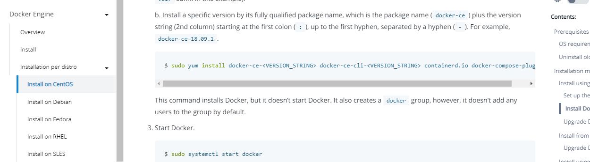

# CentOS安装docker

官方文档 ：[https://docs.docker.com/engine/install/centos/](https://docs.docker.com/engine/install/centos/)



```bash
# 1 卸载旧版本
sudo yum remove docker \
                  docker-client \
                  docker-client-latest \
                  docker-common \
                  docker-latest \
                  docker-latest-logrotate \
                  docker-logrotate \
                  docker-engine

# 2 安装必要依赖

sudo yum install -y yum-utils

# 3 设置存储库  （国内会报错，所以不按官方文档走） 这里我们采用aliyun库
sudo yum-config-manager --add-repo http://mirrors.aliyun.com/docker-ce/linux/centos/docker-ce.repo

# 4 安装docker 一路按Y
sudo yum install docker-ce docker-ce-cli containerd.io docker-compose-plugin

# 5 检测docker版本
docker version

#  6 设置开机自启
systemctl enable docker

#7 启动docker
systemctl start docker

# 8 跑hello-world
sudo docker run hello-world

# 9  到阿里云容器镜像服务 里 修改为阿里云的镜像仓库加速 ，并设单个容器日志最大存储
# https://cr.console.aliyun.com/cn-hangzhou/instances

sudo mkdir -p /etc/docker
sudo tee /etc/docker/daemon.json <<-'EOF'
{
  "registry-mirrors": ["https://hh58wswg.mirror.aliyuncs.com"],
  "log-driver":"json-file",
 "log-opts": {"max-size":"100m", "max-file":"1"}
}
EOF
sudo systemctl daemon-reload
sudo systemctl restart docker

```

docker exec 服务id /bin/bash