### <center>初识SpringSecurity
***
## 参考

来源于黑马程序员： [手把手教你精通新版SpringSecurity](https://www.bilibili.com/video/BV1EE411u7YV?p=1)

## 权限管理概念

权限管理，一般指根据系统设置的安全规则或者安全策略，用户可以访问而且只能访问自己被授权的资源。权限管
理几乎出现在任何系统里面，前提是需要有用户和密码认证的系统。

> 在权限管理的概念中，有两个非常重要的名词：
>
> - 认证：通过用户名和密码成功登陆系统后，让系统得到当前用户的角色身份。
> - 授权：系统根据当前用户的角色，给其授予对应可以操作的权限资源。

## 完成权限管理需要三个对象

- 用户：主要包含用户名，密码和当前用户的角色信息，可实现认证操作。
- 角色：主要包含角色名称，角色描述和当前角色拥有的权限信息，可实现授权操作。
- 权限：权限也可以称为菜单，主要包含当前权限名称，url地址等信息，可实现动态展示菜单。

> 注：这三个对象中，用户与角色是多对多的关系，角色与权限是多对多的关系，用户与权限没有直接关系，
> 二者是通过角色来建立关联关系的。

## 初识SpringSecurity

Spring Security是spring采用AOP思想，基于servlet过滤器实现的安全框架。它提供了完善的认证机制和方法级的
授权功能。是一款非常优秀的权限管理框架。

### 创建SpringSecurity

Spring Security主要jar包功能介绍

- spring-security-core.jar：核心包，任何Spring Security功能都需要此包。
- spring-security-web.jar：web工程必备，包含过滤器和相关的Web安全基础结构代码。
- spring-security-config.jar：用于解析xml配置文件，用到Spring Security的xml配置文件的就要用到此包。
- spring-security-taglibs.jar：Spring Security提供的动态标签库，jsp页面可以用。

导入pom依赖

```pom
<dependency>
    <groupId>org.springframework.security</groupId>
    <artifactId>spring-security-taglibs</artifactId>
    <version>5.1.5.RELEASE</version>
</dependency>
<dependency>
    <groupId>org.springframework.security</groupId>
    <artifactId>spring-security-config</artifactId>
    <version>5.1.5.RELEASE</version>
</dependency>
```

最终依赖树

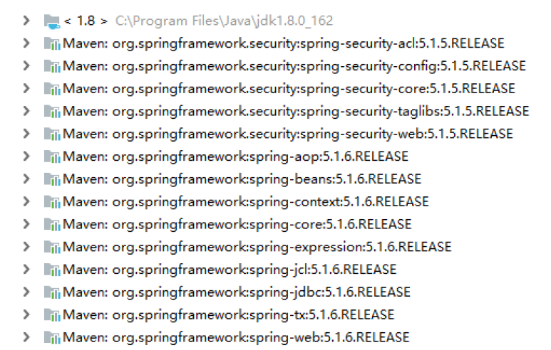

### 配置web.xml

```xml
<web-app xmlns="http://java.sun.com/xml/ns/javaee"
xmlns:xsi="http://www.w3.org/2001/XMLSchema-instance"
xsi:schemaLocation="http://java.sun.com/xml/ns/javaee
http://java.sun.com/xml/ns/javaee/web-app_3_0.xsd"
version="3.0">
<display-name>Archetype Created Web Application</display-name>
<!--Spring Security过滤器链，注意过滤器名称必须叫springSecurityFilterChain-->
    <filter>
        <filter-name>springSecurityFilterChain</filter-name>
        <filter-class>org.springframework.web.filter.DelegatingFilterProxy</filter-class>
    </filter>
    <filter-mapping>
        <filter-name>springSecurityFilterChain</filter-name>
        <url-pattern>/*</url-pattern>
    </filter-mapping>
</web-app>
```

### 配置SpringSecurity.xml

```xml
<?xml version="1.0" encoding="UTF-8"?>
<beans xmlns="http://www.springframework.org/schema/beans"
xmlns:xsi="http://www.w3.org/2001/XMLSchema-instance"
xmlns:context="http://www.springframework.org/schema/context"
xmlns:aop="http://www.springframework.org/schema/aop"
xmlns:tx="http://www.springframework.org/schema/tx"
xmlns:security="http://www.springframework.org/schema/security"
xsi:schemaLocation="http://www.springframework.org/schema/beans
http://www.springframework.org/schema/beans/spring-beans.xsd
http://www.springframework.org/schema/context
http://www.springframework.org/schema/context/spring-context.xsd
http://www.springframework.org/schema/aop
http://www.springframework.org/schema/aop/spring-aop.xsd
http://www.springframework.org/schema/tx
http://www.springframework.org/schema/tx/spring-tx.xsd
http://www.springframework.org/schema/security
http://www.springframework.org/schema/security/spring-security.xsd">
	<!--设置可以用spring的el表达式配置Spring Security并自动生成对应配置组件（过滤器）-->
    <security:http auto-config="true" use-expressions="true">
     	<!--使用spring的el表达式来指定项目所有资源访问都必须有ROLE_USER或ROLE_ADMIN角色-->
    	<security:intercept-url pattern="/**" access="hasAnyRole('ROLE_USER','ROLE_ADMIN')"/>
    </security:http>
    
    <!--设置Spring Security认证用户信息的来源 {noop}表示不加密认证-->
    <security:authentication-manager>
    	<security:authentication-provider>
    		<security:user-service>
			    <security:user name="user" password="{noop}user"
			    authorities="ROLE_USER" />
		    	<security:user name="admin" password="{noop}admin"
		    	authorities="ROLE_ADMIN" />
		    </security:user-service>
    	</security:authentication-provider>
    </security:authentication-manager>
</beans>
```

## SpringSecurity常用过滤器介绍

过滤器是一种典型的AOP思想

### SecurityContextPersistenceFilter

首当其冲的一个过滤器，作用之重要，自不必多言。

SecurityContextPersistenceFilter主要是使用SecurityContextRepository在session中保存或更新一SecurityContext，并将SecurityContext给以后的过滤器使用，来为后续filter建立所需的上下文。SecurityContext中存储了当前用户的认证以及权限信息。

### WebAsyncManagerIntegrationFilter

此过滤器用于集成SecurityContext到Spring异步执行机制中的WebAsyncManager
### HeaderWriterFilter

向请求的Header中添加相应的信息,可在http标签内部使用security:headers来控制（仅限于JSP页面）

### CsrfFilter

csrf又称跨域请求伪造，SpringSecurity会对所有post请求验证是否包含系统生成的csrf的token信息，
如果不包含，则报错。起到防止csrf攻击的效果。

### LogoutFilter

匹配URL为/logout的请求，实现用户退出,清除认证信息。

### UsernamePasswordAuthenticationFilter

认证操作全靠这个过滤器，默认匹配URL为/login且必须为POST请求。

### DefaultLoginPageGeneratingFilter

如果没有在配置文件中指定认证页面，则由该过滤器生成一个默认认证页面。

### DefaultLogoutPageGeneratingFilter

由此过滤器可以生产一个默认的退出登录页面

### BasicAuthenticationFilter

此过滤器会自动解析HTTP请求中头部名字为Authentication，且以Basic开头的头信息。

### RequestCacheAwareFilter

通过HttpSessionRequestCache内部维护了一个RequestCache，用于缓存HttpServletRequest

### SecurityContextHolderAwareRequestFilter

针对ServletRequest进行了一次包装，使得request具有更加丰富的API

### AnonymousAuthenticationFilter

当SecurityContextHolder中认证信息为空,则会创建一个匿名用户存入到SecurityContextHolder中。
spring security为了兼容未登录的访问，也走了一套认证流程，只不过是一个匿名的身份。

> 当用户以游客身份登录的时候，也就是可以通过设置某些接口可以匿名访问

### SessionManagementFilter

SecurityContextRepository限制同一用户开启多个会话的数量

### ExceptionTranslationFilter

异常转换过滤器位于整个springSecurityFilterChain的后方，用来转换整个链路中出现的异常

### FilterSecurityInterceptor

获取所配置资源访问的授权信息，根据SecurityContextHolder中存储的用户信息来决定其是否有权
限

> 该过滤器限制哪些资源可以访问，哪些不能够访问

## SpringSecurity过滤器链加载原理

通过前面十五个过滤器功能的介绍，对于SpringSecurity简单入门中的疑惑是不是在心中已经有了答案了呀？
但新的问题来了！我们并没有在web.xml中配置这些过滤器啊？它们都是怎么被加载出来的？

### DelegatingFilterProxy

我们在web.xml中配置了一个名称为springSecurityFilterChain的过滤器DelegatingFilterProxy，接下我直接对
DelegatingFilterProxy源码里重要代码进行说明，其中删减掉了一些不重要的代码，大家注意我写的注释就行了！

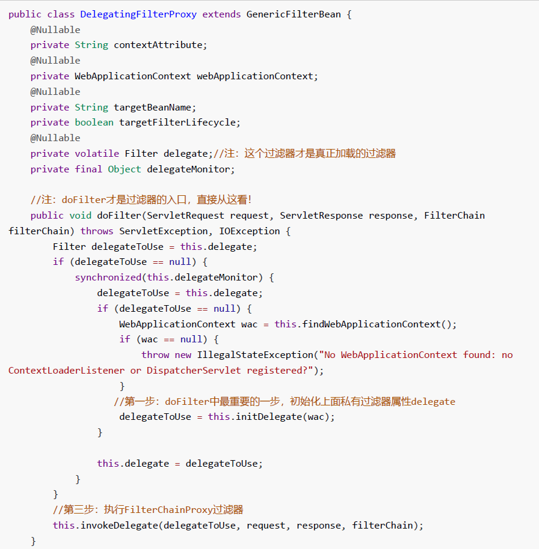


第二步debug结果如下


由此可知，DelegatingFilterProxy通过springSecurityFilterChain这个名称，得到了一个FilterChainProxy过滤器，最终在第三步执行了这个过滤器。

### FilterChainProxy

注意代码注释！注意代码注释！注意代码注释！


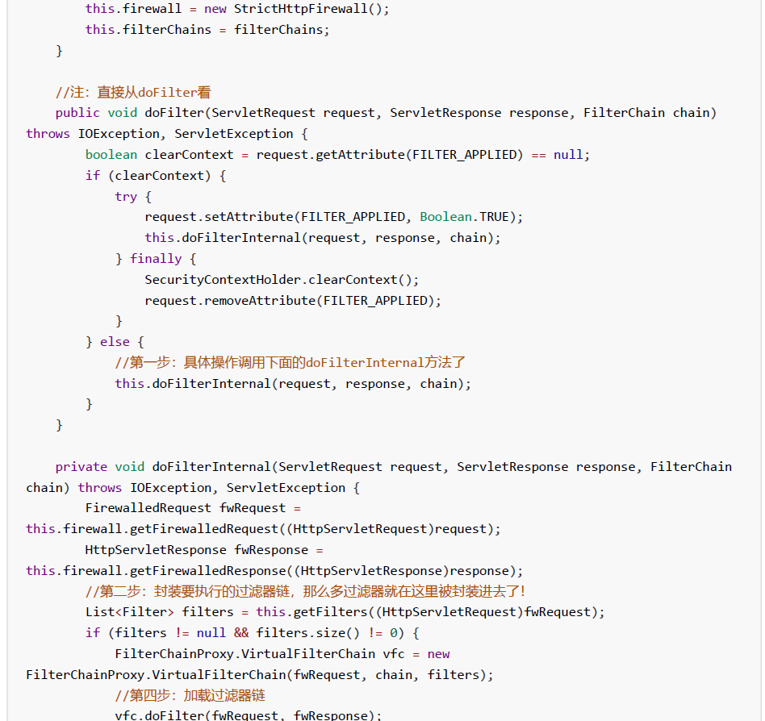

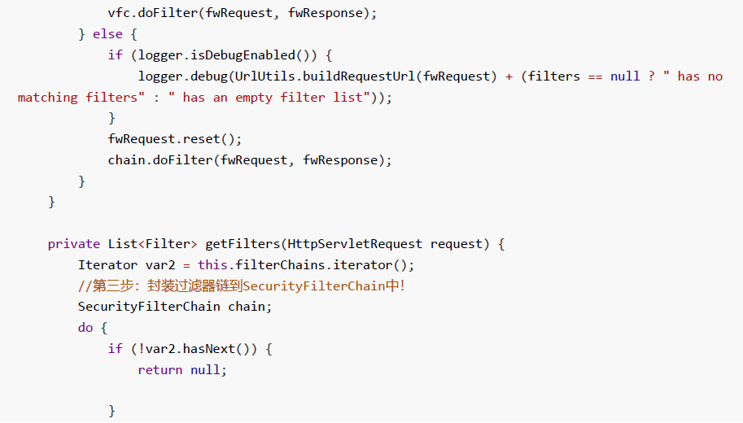

第二步debug结果如下图所示，惊不惊喜？十五个过滤器都在这里了！

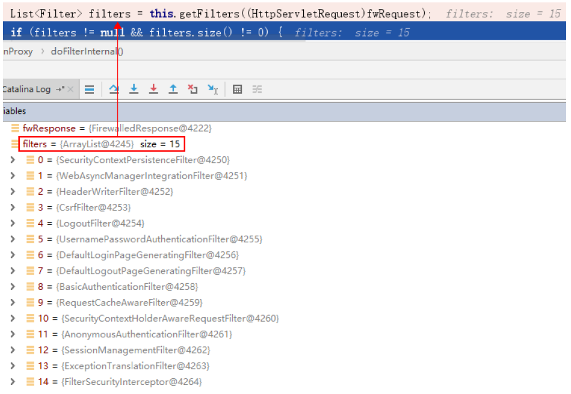

再看第三步，怀疑这么久！原来这些过滤器还真是都被封装进SecurityFilterChain中了。

### SecurityFilterChain

最后看SecurityFilterChain，这是个接口，实现类也只有一个，这才是web.xml中配置的过滤器链对象！


### 总结

通过此章节，我们对SpringSecurity工作原理有了一定的认识。但理论千万条，功能第一条，探寻底层，是
为了更好的使用框架。

那么，言归正传！到底如何使用自己的页面来实现SpringSecurity的认证操作呢？要完成此功能，首先要有一套
自己的页面！

## SpringSecurity使用自定义认证页面

在SpringSecurity主配置文件中指定认证页面配置信息

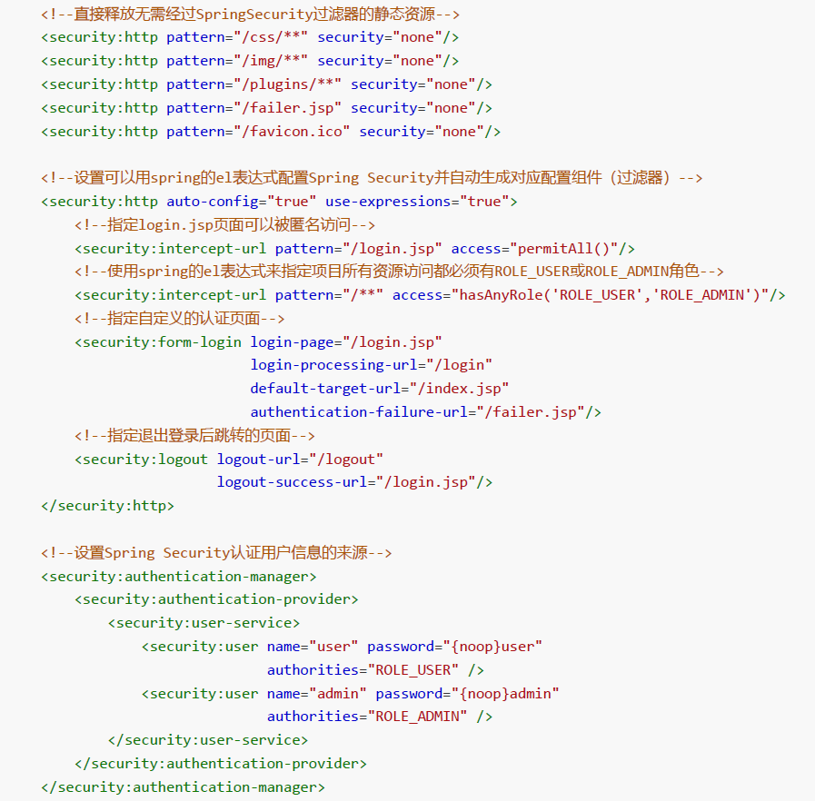

修改认证页面的请求地址


再次启动项目后就可以看到自定义的酷炫认证页面了！


然后你开开心心的输入了用户名user，密码user，就出现了如下的界面：

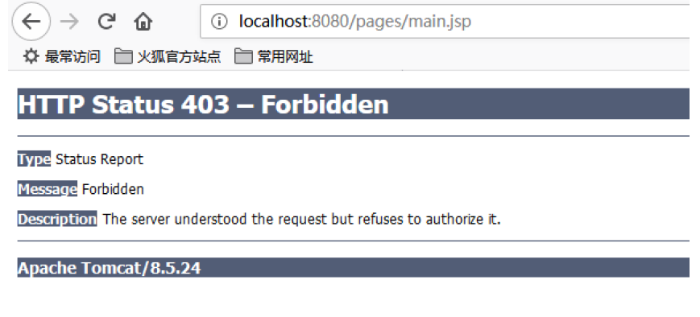

403什么异常？这是SpringSecurity中的权限不足！这个异常怎么来的？还记得上面SpringSecurity内置认证页面源码中的那个_csrf隐藏input吗？问题就在这了！

完整的spring-security配置如下

```xml
<?xml version="1.0" encoding="UTF-8"?>
<beans xmlns="http://www.springframework.org/schema/beans"
        xmlns:xsi="http://www.w3.org/2001/XMLSchema-instance"
        xmlns:context="http://www.springframework.org/schema/context"
        xmlns:aop="http://www.springframework.org/schema/aop"
        xmlns:tx="http://www.springframework.org/schema/tx"
        xmlns:mvc="http://www.springframework.org/schema/mvc"
        xmlns:security="http://www.springframework.org/schema/security"
        xsi:schemaLocation="http://www.springframework.org/schema/beans
			    http://www.springframework.org/schema/beans/spring-beans.xsd
			    http://www.springframework.org/schema/context
			    http://www.springframework.org/schema/context/spring-context.xsd
			    http://www.springframework.org/schema/aop
			    http://www.springframework.org/schema/aop/spring-aop.xsd
			    http://www.springframework.org/schema/tx
			    http://www.springframework.org/schema/tx/spring-tx.xsd
			    http://www.springframework.org/schema/mvc
			    http://www.springframework.org/schema/mvc/spring-mvc.xsd
                http://www.springframework.org/schema/security
			    http://www.springframework.org/schema/security/spring-security.xsd">

    <!--释放静态资源-->
    <security:http pattern="/css/**" security="none"/>
    <security:http pattern="/img/**" security="none"/>
    <security:http pattern="/plugins/**" security="none"/>
    <security:http pattern="/failer.jsp" security="none"/>
    <!--配置springSecurity-->
    <!--
    auto-config="true"  表示自动加载springsecurity的配置文件
    use-expressions="true" 表示使用spring的el表达式来配置springsecurity
    -->
    <security:http auto-config="true" use-expressions="true">
        <!--让认证页面可以匿名访问-->
        <security:intercept-url pattern="/login.jsp" access="permitAll()"/>
        <!--拦截资源-->
        <!--
        pattern="/**" 表示拦截所有资源
        access="hasAnyRole('ROLE_USER')" 表示只有ROLE_USER角色才能访问资源
        -->
        <security:intercept-url pattern="/**" access="hasAnyRole('ROLE_USER')"/>
        <!--配置认证信息-->
        <security:form-login login-page="/login.jsp"
                             login-processing-url="/login"
                             default-target-url="/index.jsp"
                             authentication-failure-url="/failer.jsp"/>
        <!--配置退出登录信息-->
        <security:logout logout-url="/logout"
                         logout-success-url="/login.jsp"/>
        <!--去掉csrf拦截的过滤器-->
        <!--<security:csrf disabled="true"/>-->
    </security:http>

    <!--把加密对象放入的IOC容器中-->
    <bean id="passwordEncoder" class="org.springframework.security.crypto.bcrypt.BCryptPasswordEncoder"/>

    <!--设置Spring Security认证用户信息的来源-->
    <!--
    springsecurity默认的认证必须是加密的，加上{noop}表示不加密认证。
    -->
    <security:authentication-manager>
        <security:authentication-provider user-service-ref="userServiceImpl">
            <security:password-encoder ref="passwordEncoder"/>
        </security:authentication-provider>
    </security:authentication-manager>
</beans>
```

## SpringSecurity的csrf防护机制

CSRF（Cross-site request forgery）跨站请求伪造，是一种难以防范的网络攻击方式。

SpringSecurity中CsrfFilter过滤器说明


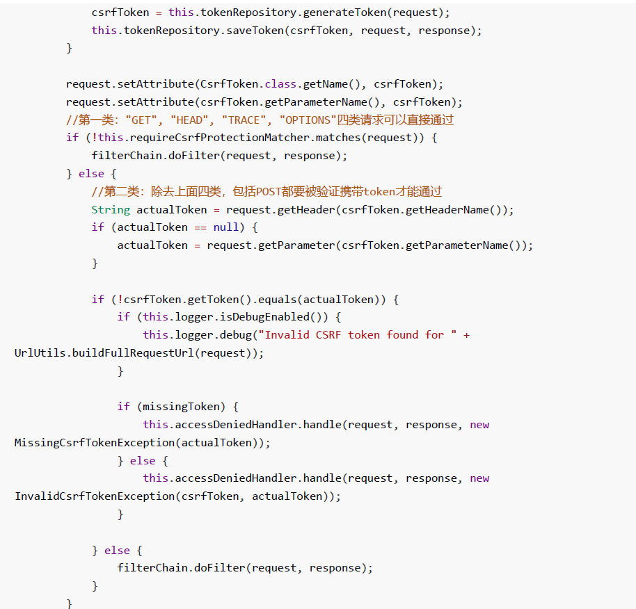

通过源码分析，我们明白了，自己的认证页面，请求方式为POST，但却没有携带token，所以才出现了403权限不
足的异常。那么如何处理这个问题呢？

方式一：直接禁用csrf，不推荐。

方式二：在认证页面携带token请求。

### 禁用csrf防护机制

在SpringSecurity主配置文件中添加禁用crsf防护的配置。

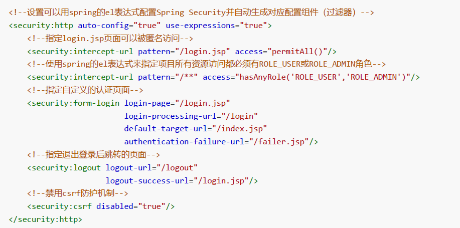

### 在认证页面携带token请求


注：HttpSessionCsrfTokenRepository对象负责生成token并放入session域中。

## SpringSecurity使用数据库数据完成认证

### 认证流程

先看主要负责认证的过滤器UsernamePasswordAuthenticationFilter，有删减，注意注释。


上面的过滤器的意思就是，我们发送的登录请求，请求地址需要是 /login，请求方法 post，然后用户名 username，密码为 password

### AuthenticationManager

由上面源码得知，真正认证操作在AuthenticationManager里面！然后看AuthenticationManager的实现类ProviderManager：

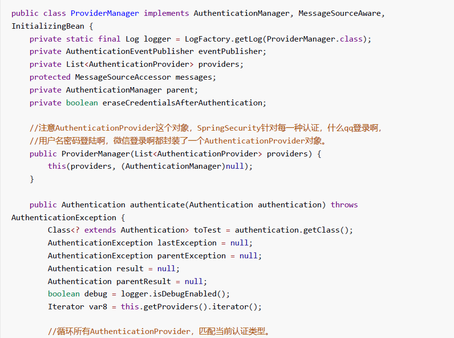

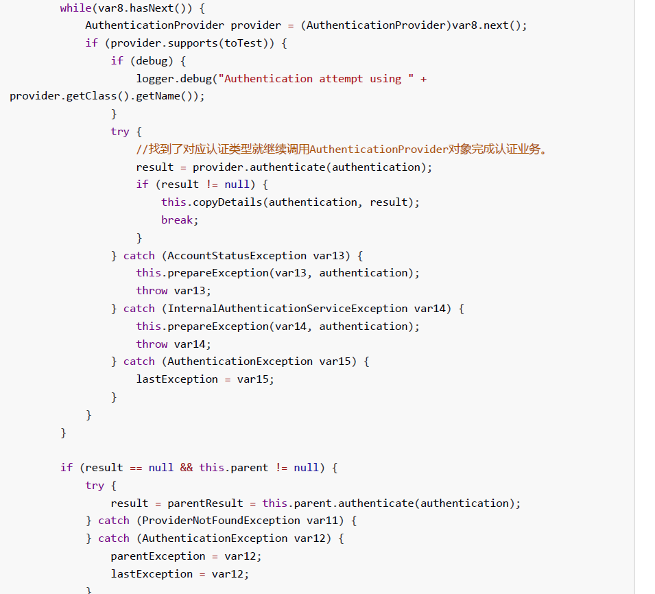

### AbstractUserDetailsAuthenticationProvider

咱们继续再找到AuthenticationProvider的实现类AbstractUserDetailsAuthenticationProvider


### AbstractUserDetailsAuthenticationProvider中authenticate返回值

按理说到此已经知道自定义认证方法的怎么写了，但咱们把返回的流程也大概走一遍，上面不是说到返回了一个
UserDetails对象对象吗？跟着它，就又回到了AbstractUserDetailsAuthenticationProvider对象中authenticate方法的最后一行了。


### UsernamePasswordAuthenticationToken

来到UsernamePasswordAuthenticationToken对象发现里面有两个构造方法

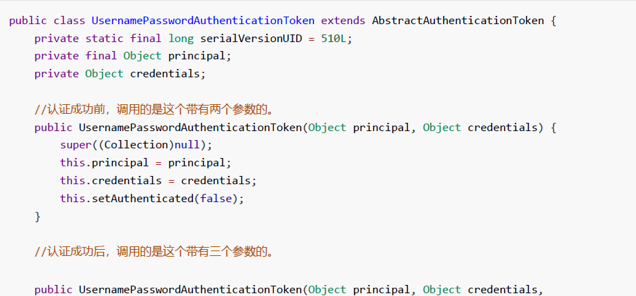


### AbstractAuthenticationToken

再点进去super(authorities)看看：

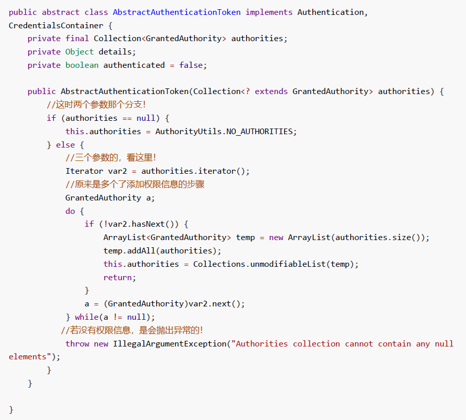

由此，咱们需要牢记自定义认证业务逻辑返回的UserDetails对象中一定要放置权限信息啊！

现在可以结束源码分析了吧？先不要着急！

咱们回到最初的地方UsernamePasswordAuthenticationFilter，你看好看了，这可是个过滤器，咱们分析这么
久，都没提到doFilter方法，你不觉得心里不踏实？

可是这里面也没有doFilter呀？那就从父类找！

### AbstractAuthenticationProcessingFilter

点开AbstractAuthenticationProcessingFilter，删掉不必要的代码！

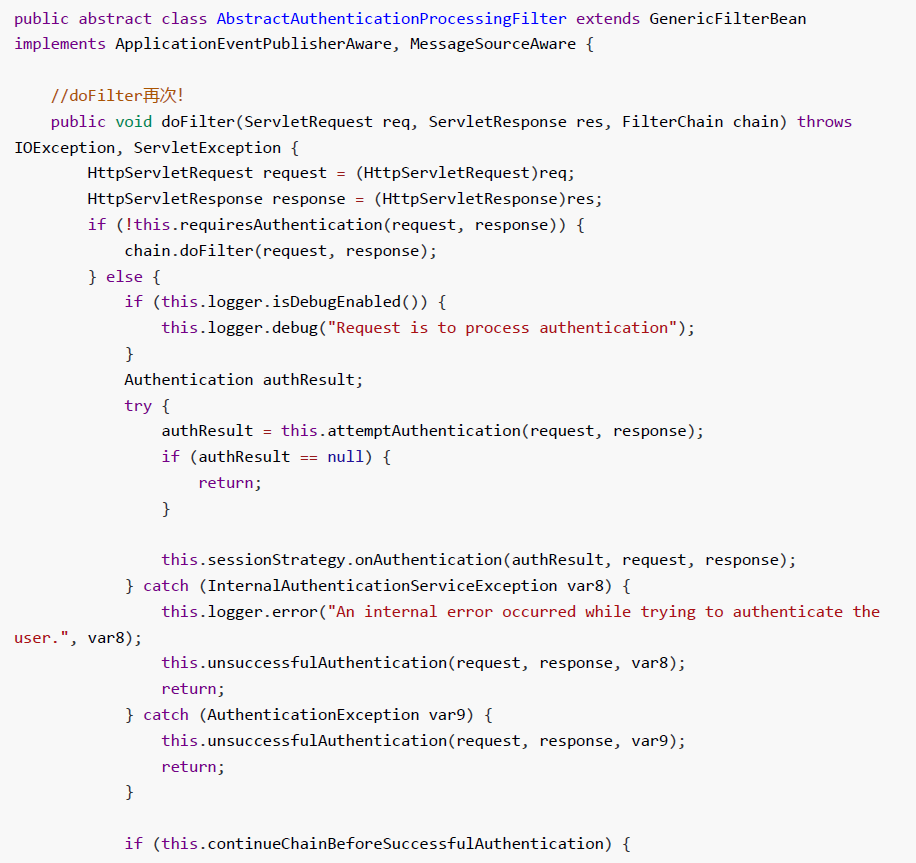

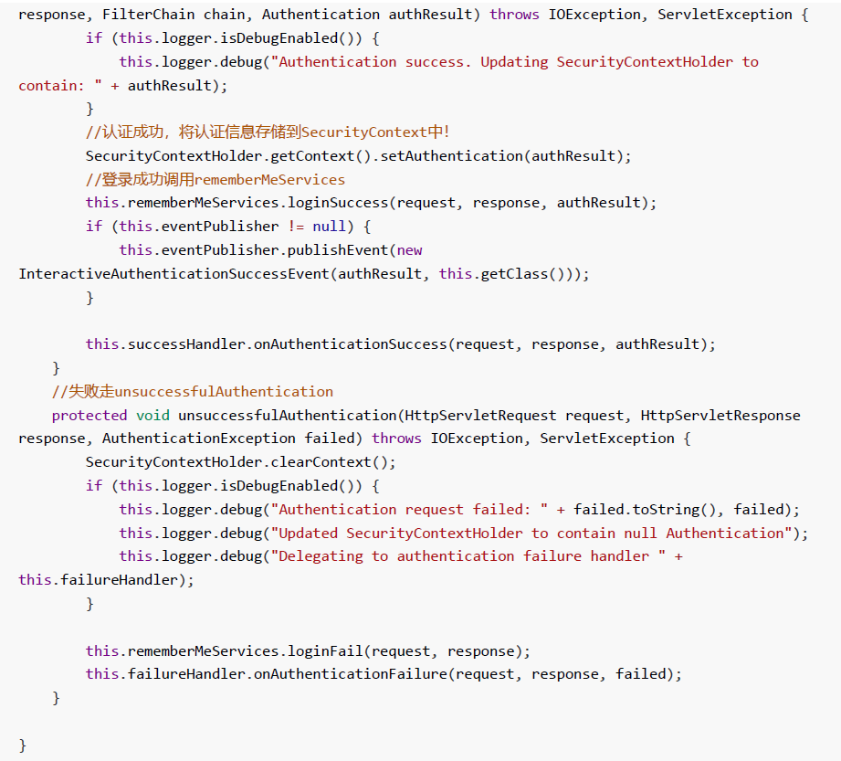

可见AbstractAuthenticationProcessingFilter这个过滤器对于认证成功与否，做了两个分支，成功执行
successfulAuthentication，失败执行unsuccessfulAuthentication。

在successfulAuthentication内部，将认证信息存储到了SecurityContext中。并调用了loginSuccess方法，这就是
常见的“记住我”功能！此功能具体应用，咱们后续再研究！

## 初步实现认证功能

让我们自己的UserService接口继承UserDetailsService，毕竟SpringSecurity是只认UserDetailsService的：

### 创建UserDetailsService

```java
public interface UserService extends UserDetailsService {
    public void save(SysUser user);
    public List<SysUser> findAll();
    public Map<String, Object> toAddRolePage(Integer id);
    public void addRoleToUser(Integer userId, Integer[] ids);
}
```

### 编写loadUserByUsername业务

```java
@Override
public UserDetails loadUserByUsername(String username) throws UsernameNotFoundException {
    SysUser sysUser = userDao.findByName(username);
    if(sysUser==null){
        //若用户名不对，直接返回null，表示认证失败。
        return null;
    }
    List<SimpleGrantedAuthority> authorities = new ArrayList<>();
    List<SysRole> roles = sysUser.getRoles();
    for (SysRole role : roles) {
    	authorities.add(new SimpleGrantedAuthority(role.getRoleName()));
    }
    //最终需要返回一个SpringSecurity的UserDetails对象，{noop}表示不加密认证。
    return new User(sysUser.getUsername(), "{noop}"+sysUser.getPassword(), authorities);
}
```

### 在SpringSecurity主配置文件中指定认证使用的业务对象

```xml
<!--设置Spring Security认证用户信息的来源-->
<security:authentication-manager>
<security:authentication-provider user-service-ref="userServiceImpl">
</security:authentication-provider>
</security:authentication-manager>
```

## 加密认证

### 在IOC容器中提供加密对象

```xml
<!--加密对象-->
<bean id="passwordEncoder"
class="org.springframework.security.crypto.bcrypt.BCryptPasswordEncoder"/>
<!--设置Spring Security认证用户信息的来源-->
    <security:authentication-manager>
        <security:authentication-provider user-service-ref="userServiceImpl">
        <!--指定认证使用的加密对象-->
        <security:password-encoder ref="passwordEncoder"/>
    </security:authentication-provider>
</security:authentication-manager>
```

### 修改认证方法

去掉{noop}，该方法可以让我们的密码不加密

```java
@Override
public UserDetails loadUserByUsername(String username) throws UsernameNotFoundException {
    SysUser sysUser = userDao.findByName(username);
    if(sysUser==null){
        //若用户名不对，直接返回null，表示认证失败。
        return null;
    }
    List<SimpleGrantedAuthority> authorities = new ArrayList<>();
    List<SysRole> roles = sysUser.getRoles();
    for (SysRole role : roles) {
    	authorities.add(new SimpleGrantedAuthority(role.getRoleName()));
    }
    //最终需要返回一个SpringSecurity的UserDetails对象，{noop}表示不加密认证。
    return new User(sysUser.getUsername(), sysUser.getPassword(), authorities);
}
```

### 修改添加用户的操作

```java
@Service
@Transactional
public class UserServiceImpl implements UserService {
    @Autowired
    private UserDao userDao;
    @Autowired
    private RoleService roleService;
    @Autowired
    private BCryptPasswordEncoder passwordEncoder;
    @Override
    public void save(SysUser user) {
        //对密码进行加密，然后再入库
        user.setPassword(passwordEncoder.encode(user.getPassword()));
        userDao.save(user);
	}
}
```

### 手动将数据库中用户密码改为加密后的密文

