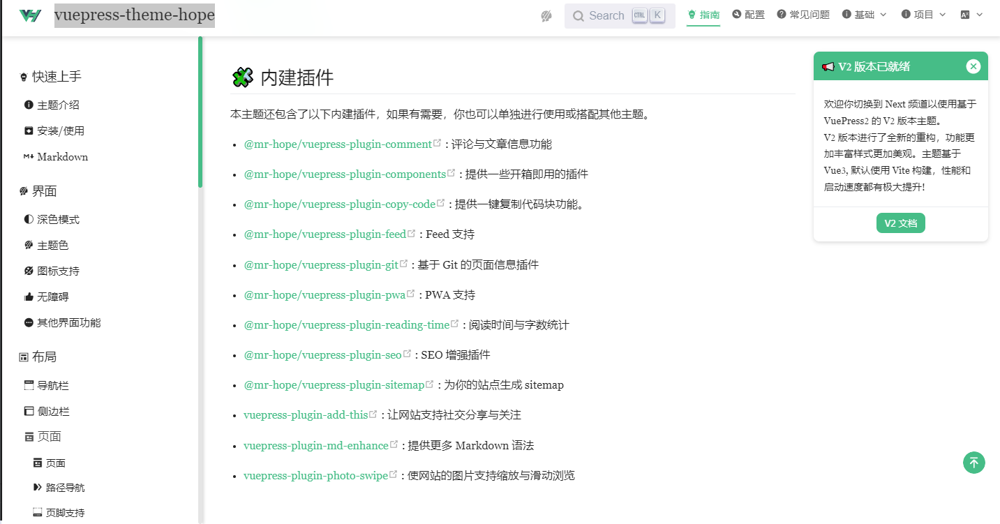
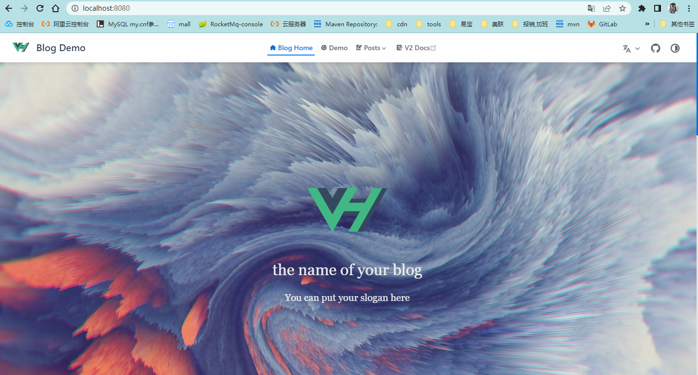

### <center>GITPAGE-docify转vuepress-theme-hope
***
## 前言

docify没有seo优化，标签，而且响应速度不理想等等问题，so转用vuepress-theme-hope。

1. 首先我们进入官网 
   https://vuepress-theme-hope.gitee.io/v1/zh/guide/feature/  
   

执行以下命令后
```shell
npm init vuepress-theme-hope@next docs
```
  
等待若干分钟后。。。按y,打开浏览器访问 http://localhost:8080
vuepress-theme-hope的默认首页
  
