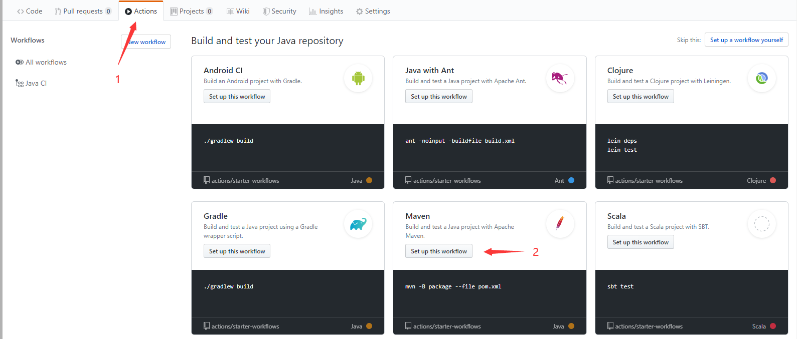
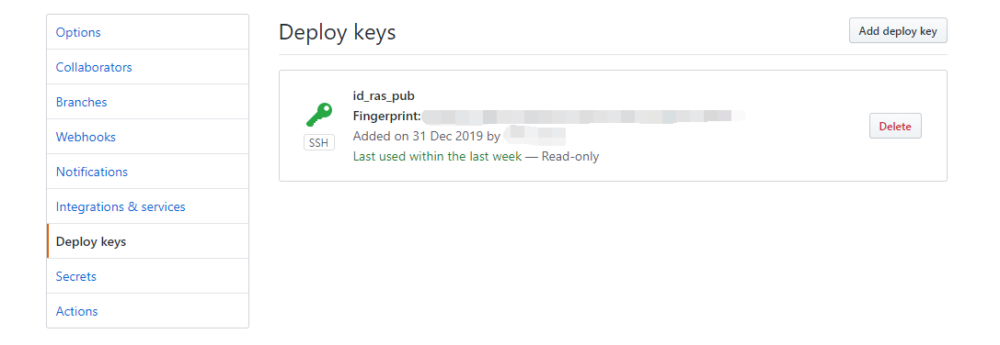

### <center>Github Actions完成Spring boot编译部署任务
***
## 前言

官网介绍：GitHub Actions提供了一个强大的执行环境，可以集成到你的工作流程的每一步。您可以发现、创建和共享操作来执行任何您想要的作业，并将它们组合起来以定制您的工作流。


## 1.开始一个Actions

我们选




这时候会自动创建一个maven.yml

    name: Java CI     #Actions名称
    
    on: [push]        #Action触发条件
    
    jobs:
      build:
    	runs-on: ubuntu-latest    #运行环境
    
    steps:
    - uses: actions/checkout@v1    #获得你该仓库的v1分支
    - name: Set up JDK 1.8
      uses: actions/setup-java@v1  #使用官方脚本创建java环境
      with:
        java-version: 1.8
    - name: Build with Maven
      run: mvn -B package --file pom.xml
这是我写的

- ```yml
  name: Java CI     #Actions名称
  
  on: 
    push:
      branches: 
        - master       #在提交master时触发
  
  jobs:
    build:
  	runs-on: ubuntu-latest    #运行环境
  
  steps:
  
  - uses: actions/checkout@master    #获取master分支
  - name: Set up JDK 1.8
    uses: actions/setup-java@v1  #使用官方脚本创建java环境
    with:
      java-version: 1.8
  ```

# 2.配置config免密

因为我们需要在编译的时候获取到线上环境的config，而线上环境的config有很多服务器密码等信息。所以需要创建一个私有库来存放这些信息。

创建好私有库后。我们需要配置github该私有库的免密登录。

```shell
ssh-keygen -t rsa
```

这时候会生成id_rsa  id_rsa.pub两个文件。

我们将id_rsa.pub文件中的内容放入该私有库

Settings->Deploy keys



将id_rsa中的内容写入项目的Secrets中（非配置文件私有库）

这样我们就可以在Actions中引入该私钥而不会暴露出来。

在Actions中写入该步骤，实现Actions中的服务器可以访问私有库

通过${{ secrets.xxxxx }}引用，实例如下

```shell
  - name: Set SSH Environment
    run: |
      mkdir -p ~/.ssh/
      echo "${{ secrets.ID_RSA }}" > ~/.ssh/id_rsa
      echo "${{ secrets.ID_RSA_PUB }}" > ~/.ssh/id_rsa.pub
      cat ~/.ssh/id_rsa.pub >> ~/.ssh/authorized_keys
      chmod 600 ~/.ssh/id_rsa
      chmod 700 ~/.ssh && chmod 700 ~/.ssh/*
      ls -l ~/.ssh/
```


补充

*密钥验证*

- 机器1生成密钥对并将公钥发给机器2，机器2将公钥保存。
- 机器1要登录机器2时，机器2生成随机字符串并用机器1的公钥加密后，发给机器1。
- 机器1用私钥将其解密后发回给机器2，验证成功后登录

# 3.获得config

通过git clone命名获取私有库config

git clone git@github.com:xxxx/xxxx_config.git

之后就可以编写自己的build过程

# 4.将构建的jar包拷贝到自己服务器

这里我们使用别人写好scp的Actions组件，将Actions服务器中的编译好的文件传输到我们自己的服务器。

```shell
- name: scp
  uses: garygrossgarten/github-action-scp@release
  with:
    local: xxx 本地文件
    remote: xxx 远程文件
    host: ${{ secrets.DOCKER_IP }}
    username: ${{ secrets.DOCKER_ID }}
    password: ${{ secrets.DOCKER_PASSWORD }}
    port: ${{ secrets.DOCKER_PORT }}
```
# 5.ssh到我们自己的服务器上执行命令

```shell
  - name: start_eureka
    uses: appleboy/ssh-action@master
    with:
      host: ${{ secrets.DOCKER_IP }}
      username: ${{ secrets.DOCKER_ID }}
      password: ${{ secrets.DOCKER_PASSWORD }}
      port: ${{ secrets.DOCKER_PORT }}
      script: |
      	cd xxxx
        ./xxxxx
```

整个过程就完成了

# 6.问题

由于Actions服务器本身的限制问题，我们无法使用系统自带的scp和ssh命令，只能使用别人重写的脚本执行相关命令。

## 7.最终效果


