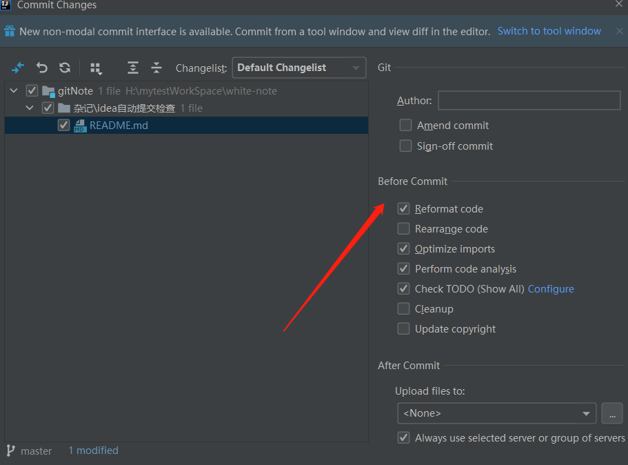

### 
idea自动提交检查

***

git提交时before commit

| Operation    | Description | 
| --- | --- |
| Reformat code | Perform code formatting according to the Project Code Style settings.|
| Rearrange code | Rearrange your code according to the arrangement rules preferences.|
|Optimize imports | Remove redundant import statements.|
| Perform code analysis | Perform code analysis Run code inspection on the files you are about to commit/shelve.|
| Check TODO (filter name) | Review the TODO items matching the specified filter. Click Configure to choose an existing TODO filter, or open the TODO settings page and define a new filter to be applied.|
|Cleanup |Automatically apply the current inspection profile to the files you are going to commit/shelve.|
| Update copyright | Add or update a copyright notice according to the selected copyright profile - scope combination.|

|方法|    描述|
| --- | --- |
|重新格式化代码    |根据项目代码样式设置执行代码格式化。|
|重新排列代码|    根据排列规则首选项重新排列代码。|
|优化导入    |删除多余的导入语句。|
|执行代码分析    |执行代码分析 对您将要提交/搁置的文件运行代码检查。|
|检查 TODO（过滤器名称）|    查看与指定过滤器匹配的 TODO 项。单击配置以选择现有的 TODO 过滤器，或打开 TODO 设置页面并定义要应用的新过滤器。|
|清理    |自动将当前检查配置文件应用于您要提交/搁置的文件。|
|更新版权    |根据选定的版权配置文件 - 范围组合添加或更新版权声明。|